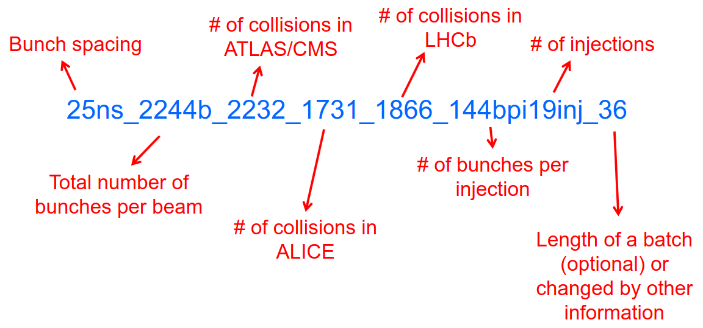

Data Manager & Shift Leader for Run 3 – Notes
=============================================

Useful links
------------

-  `Shift Database <http://lbshiftdb.cern.ch/>`__
-  `ShifterFormalities <https://lbtwiki.cern.ch/bin/view/Operation/ShifterFormalities>`__
-  `Shifter
   Instructions <https://lbtwiki.cern.ch/bin/view/Operation/ShifterInstructions>`__
-  `Shifter
   Checklist <https://lbtwiki.cern.ch/bin/view/Operation/SoSchecklist>`__
-  `Operation
   Twiki <http://lbtwiki.cern.ch/bin/view/Operation/WebHome>`__
-  `Shift LogBook <https://lblogbook.cern.ch/Shift/>`__
-  `MONET <https://lbwebmonet.cern.ch/>`__
-  `MONET
   documentation <https://its.cern.ch/jira/projects/LHCBMONET/summary>`__
-  `JIRA Monet problem
   database <https://its.cern.ch/jira/projects/LBRUNPROBLEMS/issues/?filter=allopenissues>`__
-  `JIRA Monet
   development <https://its.cern.ch/jira/projects/LHCBMONET/summary>`__
-  `Training
   slides <https://edms.cern.ch/ui/#!master/navigator/document?D:101448234:101448234:subDocs>`__
-  `Mattermost
   channel <https://mattermost.web.cern.ch/lhcb/channels/lhcb-run3-shifter-support-channel>`__
-  `Run Meeting <https://indico.cern.ch/category/669/>`__ @ 9:30
-  `SLIMOS
   instructions <https://lbdokuwiki.cern.ch/infrastructure:instructionsforslimos>`__

Acronyms
--------

+------+-----------------------------------------+---------------------+
|      | Definition                              | Note                |
+======+=========================================+=====================+
| AI   | Analog Inputs                           |                     |
+------+-----------------------------------------+---------------------+
| BE_OP| machine operations                      |                     |
+------+-----------------------------------------+---------------------+
| BPIM | Beam Phase and Intensity Monitor        |                     |
+------+-----------------------------------------+---------------------+
| BCM  | Beam Conditions Monitor                 | or Main Background  |
|      |                                         | Monitor             |
+------+-----------------------------------------+---------------------+
| CCC  | CERN Control ROOM                       |                     |
+------+-----------------------------------------+---------------------+
| CR   | Control Room                            |                     |
+------+-----------------------------------------+---------------------+
| CSAM | CERN Safety Alarm Monitoring            |                     |
+------+-----------------------------------------+---------------------+
| DAI  | Data Acquisition Infrastructure         |                     |
+------+-----------------------------------------+---------------------+
| DDS  | Detector Safety System                  |                     |
+------+-----------------------------------------+---------------------+
| DI   | Digital Inputs                          |                     |
+------+-----------------------------------------+---------------------+
| DM   | Data Manager                            |                     |
+------+-----------------------------------------+---------------------+
| DQ   | Data Quality                            |                     |
+------+-----------------------------------------+---------------------+
| ECS  | Experiment Control System               |                     |
+------+-----------------------------------------+---------------------+
| EIC  | Engineers-In-Charge                     | accelerator         |
|      |                                         | operations          |
+------+-----------------------------------------+---------------------+
| EN-CV| CERN cooling group                      |                     |
+------+-----------------------------------------+---------------------+
| E    | CERN electrical service                 |                     |
| N-EL |                                         |                     |
+------+-----------------------------------------+---------------------+
| ESO  | Electrical Safety Officer               |                     |
+------+-----------------------------------------+---------------------+
| FRS  | Fire and Rescue Service                 |                     |
+------+-----------------------------------------+---------------------+
| FSM  | Finite State Machine                    |                     |
+------+-----------------------------------------+---------------------+
| HV   | High Voltage                            |                     |
+------+-----------------------------------------+---------------------+
| IHM  | Human-Machine Interface                 |                     |
+------+-----------------------------------------+---------------------+
| LACS | LHC Access Control System               |                     |
+------+-----------------------------------------+---------------------+
| LASS | LHC Access Safety System                |                     |
+------+-----------------------------------------+---------------------+
| LBDS | LHC Beam DUmp System                    |                     |
+------+-----------------------------------------+---------------------+
| L    | Large Experiment Group Leader In        |                     |
| EXGL | Matters Of Safety                       |                     |
| IMOS |                                         |                     |
+------+-----------------------------------------+---------------------+
| LPC  | LHC PRogram Coordinator                 |                     |
+------+-----------------------------------------+---------------------+
| MAD  | Material Access Device                  |                     |
+------+-----------------------------------------+---------------------+
| MC   | Machine Coordinators                    | Run Chief at CCC    |
+------+-----------------------------------------+---------------------+
| MD   | Machine Development period              |                     |
+------+-----------------------------------------+---------------------+
| PAD  | Personnel Access Device                 |                     |
+------+-----------------------------------------+---------------------+
| PT   | Temperature Probes                      |                     |
+------+-----------------------------------------+---------------------+
| SL   | Shift Leader                            |                     |
+------+-----------------------------------------+---------------------+
| SL   | Shift Leader In Matters Of Safety       |                     |
| IMOS |                                         |                     |
+------+-----------------------------------------+---------------------+
| RC   | Run Coordinator                         |                     |
+------+-----------------------------------------+---------------------+
| RPE  | Radiation Protection Expert             |                     |
+------+-----------------------------------------+---------------------+
| RSO  | Radiation Safety Officer                |                     |
+------+-----------------------------------------+---------------------+
| TSO  | Territorial Safety Officer              |                     |
+------+-----------------------------------------+---------------------+

Phone Numbers
-------------

Prefix for CERN fixed numbers: +41 22 76 xxxxx prefix for CERN mobile
numbers: +41 75 411 xx xx

+-------------------------+--------------------------------------------+
| Name                    | Number                                     |
+=========================+============================================+
| CERN HSE-RP piquet      | (7 52 52)                                  |
+-------------------------+--------------------------------------------+
| CCC                     | +41 22 76 (7 76 00)                        |
+-------------------------+--------------------------------------------+
| CCC Techical            | (7 22 21)                                  |
| Infrastructure          |                                            |
+-------------------------+--------------------------------------------+
| Data manager            | +41 22 76 (6 35 96)                        |
+-------------------------+--------------------------------------------+
| DSS piquet/GLIMOS       | (16 80 00)                                 |
+-------------------------+--------------------------------------------+
| EP-DT magnet and DSS    | (16 20 82)                                 |
| piquet                  |                                            |
+-------------------------+--------------------------------------------+
| Fire and Rescue         | +41 22 76 (7 44 44 urgent) (7 48 48        |
|                         | non-urgent)                                |
+-------------------------+--------------------------------------------+
| LEXGLIMOS               | (16 90 56)                                 |
+-------------------------+--------------------------------------------+
| LHCb RPE piquet         | (16 80 00)                                 |
+-------------------------+--------------------------------------------+
| Run Chief               | +41 22 75 411 1868 (+41 22 76 161868)      |
+-------------------------+--------------------------------------------+
| Run Coordinator         | +41 22 76 (6 32 18)                        |
+-------------------------+--------------------------------------------+
| Shift Leader            | +41 22 76 (fixed=63595, mobile=161866)     |
+-------------------------+--------------------------------------------+

Important
---------

-  ☐ subscribe to ``lhcb-shift-leaders`` and ``lhcb-data-managers``
   mailing list
-  ☐ ``LHCB_S`` and Control Room access permission

Shifter Duties
--------------

-  ☐ SL follow the `Run
   Meeting <https://indico.cern.ch/category/669/>`__ when scheduled
-  ☐ SL take data with the **Run Control**, **Operate Voltages and
   sub-detectors** in the ``Big Brother``, handle handshakes and
   interlocks
-  ☐ DM check **data quality and do data management**
-  ☐ answer CCC phone when LHC call (if needed take notes for RC)
-  ☐ Mostly relay information about the plan of the day, ongoing
   activities, accesses, problems, LHC status, sub-detectors information
-  ☐ DM replace SL when outside CR
-  ☐ write **anything happen** in the logbook
-  ☐ Control Room Doors should be closed by 7pm
-  ☐ Global monitoring panel of LHC: check system status (if problem
   report/call CCC?)
-  ☐ Check if LHCb Timing is synchronous with LHC

Data Manager Duties
-------------------

-  ☐ check the plots in the "Shift" folder continuously. ## SLIMOS
   Duties
-  ☐ Follow up DSS alarms, acknowledge and reset.

Daily ToDo
----------

-  ☐ if night shifter print ``Who's on shift today`` @ 6am (select
   printer "color", printer near keys’ cabinet)
-  ☐ SL at the end should write a ``Shift Summary`` entry in the
   logbook: what happened in the LHC/LHCb and outstanding items to be
   done using proposed structure
-  ☐ SLIMOS check to be logged into DSS as ``slimos`` and two LEDs next
   to ``Alive`` are alternating (if not restart app or reboot the PC)

Module 1a: Central Shifters
===========================

Shift Leader (SL) and Data Manager (DM) refer directly to the Run Chief
(**while on shift** and to the Run Coordinator in general) and in
alternative to the Run Coordinator. For safety matter, they refer
directly to the (LEX-)GLIMOS.

Tasks during operations are provided to you by the Run Chief and/or the
Run Coordinator. SLs are in charge of safety but they are not in charge
of security!

``LHCB_S`` and Control Room access are mandatory for both DM and SL,
while ``LHCB_U`` is strongly recomended for SL.

.. warning::

   Never ignore DSS or Level 3 alarms: call piquet and follow procedure
   explained in safety course

.. danger::

   Meeting point for emergencies = building 2890, always carry CERN
   Access Card

.. container:: info

   Login for control room screens:
   - user: lhcb_shift
   - pswd: top of whiteboard, with ! in front…

Who you gonna call?
-------------------

.. math::  try ~piquet x3 => try~Run~Chief => Run~Coordinator

- If you know you cannot make it on time, call the current Shift Leader
  and call the Run Chief 
- If the incoming shifter does not show up
  within 15 minutes after the start time of the shift, the outgoing
  shifter should call the Run Chief 
- The experts are also available to
  answer the phones, but first you should always call the sub-detector
  piquet of the concerned system 
- If the call concerns the LHC or
  something that needs more escalating, call the Run Chief as well 
- If there is a safety issue or an alarm, call 168000 (DSS piquet or GLIMOS)
- If in doubt about the LHC doings, call the CCC to clarify

LHCb Run Control
----------------

-  The ``LHCb Run Control`` is the main panel to control all devices
   needed for data taking: keep it ``RUNNING`` configuration given by
   the RC
-  The ``Big Brother`` : Main panel to control HV, interfaces to the
   LHC, clock, BCM, magnet. never ignore an ``ERROR``.
-  The ``Alarm Screen`` : Never ignore alarms, always follow-up. Any
   observation, write it in the logbook. If you are in doubt, better
   call the concerned sub-system piquet.

LHC cycle
---------

-  ``Handshake``: :math:`Injection-> Adjust-> Dump`. Done between LHC
   and all 4 experiments, controlled via Big Brother
-  LHC filling scheme, naming convention

=========== ==========================
LHCb States Note
=========== ==========================
INJECTION   @ 450 GeV
RAMP        @ 6.8 TeV
SQUEEZE     beam transversally smaller
PHYS_ADJUST 
PHYSICS     
ADJUST      
DUMP        get rid of beams
EOF         
NO_BEAM     
=========== ==========================

LHCb Timing
~~~~~~~~~~~

The LHCb timing (clock) is centrally controlled/monitored via a set of
electronics boards called RFRx, RF2TTC and BPIM. Check status on Big
Brother.
Two modes of operations:

- INTERNAL: clock is generated locally
  in LHCb for the whole detector
- EXTERNAL: clock is received via the LHC
  and it is in phase with the beams (synchronous) 

.. container:: info
    - LHCb Clock must be in EXTERNAL while in data taking mode!
    - Phase of Beam 1 (blue) must stay within +/- 500ps
      (with some tolerance)
    - DeltaT (difference in arrival time B1/B2 @ IP) within 100ps

LHCb safety
~~~~~~~~~~~

-  LHCb Main Background Monitor rearms automatically if dump was not by
   itself :math:`->` FSM state changes ABORT_PMT :math:`->` PM_READY
   :math:`->` READY
-  if BCM dumps, and FSM stays in PM_READY waiting for manual Rearm
   :math:`->` CALL CCC "we have probably dumped and we are
   investigating", and CALL RC before rearming -use the
   ``Send to logbook`` button to record unusual activity in the
   Monitoring beam-induced background

LHCb Luminosity
~~~~~~~~~~~~~~~

PLUME monitor the LHCb luminosity

+------------------+-------------------------------------------------------+---+
| Dictionary       | Definition                                            | N |
|                  |                                                       | o |
|                  |                                                       | t |
|                  |                                                       | e |
+==================+=======================================================+===+
| :math:`\nu`    | average number of pp interaction per bunch            |   |
|                  |                                                       |   |
+------------------+-------------------------------------------------------+---+
| :math:`\mu`    | average number of **visible** pp interaction per      |   |
|                  | bunch                                                 |   |
+------------------+-------------------------------------------------------+---+
| pileup           | average number of pp interaction in visible events    |   |
+------------------+-------------------------------------------------------+---+
| cross-section    | probability of how manu pp collisions per unit time   |   |
|                  | and lumi                                              |   |
+------------------+-------------------------------------------------------+---+

+-------------------------------------------------+--------------+------------+
| Alarm on screen                                 | LED status   | Action     |
+=================================================+==============+============+
| **LHC leveling receiver not running**           | First LED is | Call       |
|                                                 | grey and     | CCC and    |
|                                                 | sentence red | ask        |
|                                                 |              | them to    |
|                                                 |              | enable     |
|                                                 |              | the        |
|                                                 |              | leveling   |
|                                                 |              | application|
+-------------------------------------------------+--------------+------------+
| **No response to leveling since 564 s**         | Second LED   | Call       |
|                                                 | and sentence | CCC and    |
|                                                 | green, first | ask        |
|                                                 | LED grey and | them to    |
|                                                 | sentence red | perform    |
|                                                 |              | leveling   |
+-------------------------------------------------+--------------+------------+
| **X-plane optimization not done, LHCb Leveling  | First LED    | Call       |
| master inhibited, please check!**               | and sentence | CCC and    |
|                                                 | green, second| them to    |
|                                                 | LED grey and | optimize   |
|                                                 | sentence red | LHCb in    |
|                                                 |              | the        |
|                                                 |              | crossing   |
|                                                 |              | plane      |
+-------------------------------------------------+--------------+------------+

if LHC is in Machine Development period, they screw arounf with the
machine.

.. container:: info
   - General rule, if already in MD stay in MD at each
     injection handshake until next physics fill.
   - Make sure the sub-detectors HV are in a state that it is consistent 
     with the LHC activities

Module 1b: Online Monitoring
============================

Checking live in the control room of the quality of the recorded data.
Crucial for the running of LHCb: data with malfunctionning detector will
most certainly be discarded for offline analysis.

Monitoring Control Unit controls the running of the monitoring tasks in
the monitoring farm :math:`->` It must be ``RUNNING`` always when we
take data

Data Sources:

- Detector raw data
- Reconstructed quantities: output of HLT or of reconstruction
monitoring jobs
- Environmental quantities, as a function of time: produced by
electronics, HV, ...
- And automatic analyses of these sources

MONET
-----

web `application <https://lbwebmonet.cern.ch/>`__ Login with the CERN
account (not the online one). Histograms can be looked at ``Live`` or in
``History mode``.

-  For online monitoring, the main folder to look at is ``OnlineMon``
-  The ``Shift`` folder that will contain a selection of important pages
   for the data manager to inspect (1 or 2 pages per detector or system)
-  The ``Reload Tree`` button can be used in case new folders were added
   by monitoring experts, to see them (otherwise no need to use this
   button)
-  ``Prev`` and ``Next`` buttons can be used to browse easily the pages:
   it will open the previous or next pages in the folder structure
-  Reference histograms are histograms selected by detector experts
   to show how the distributions are supposed to look like when
   everything works well
-  if problem is spotted: click on ``Send to ELOG`` and follow
   instructions that could be written on the MONET page itself, and
   call the sub-detector piquet (if the problem is not solved
   quickly)

A `JIRA
site <https://its.cern.ch/jira/projects/LBRUNPROBLEMS/issues/?filter=allopenissues>`__
where issues reported by data managers will be stored and followed up by
detector piquets and experts

Some predefined histogram and data analyses are implemented to detect
automatically problems in the distributions.

Module 2a: Safety
=================

Safety covers occupational health and safety, including radiation
protection, the protection of the environment and the safe operation of
CERN’s Installations (EDMS 1416908). The responsibilities and
organisational structure in matters of safety at CERN are described in
Safety Regulation SR-SO (EDMS 1389540). The Technical Coordinator is
supported by the LEXGLIMOS and other safety officers: Radiation Safety
Officer (RSO), Electrical Safety Officer (ESO), **Shift Leader In
Matters Of Safety** (SLIMOS). Handling safety alarms takes precedence
over other Shift Leader tasks.

SLIMOS are expected to:

- be knowledgeable about the safety aspects of the experiment
- handle alarms and emergency situations 
- operate safety systems

Handling alarms usually involves contacting experts/piquets and – in
case of Level-3 alarms – the CERN Fire and Rescue Service. The DSS/RPE
piquet (16 80 00) is your first-line contact in LHCb for all matters of
safety and technical infrastructure. (as backup option use intercoms
on Emergency Panel)

In case of **Evacuation**:

- Control Room assembly point outside the SY8 building 
- Take the shift leader mobile phone and the list of
  contacts with you. 
- Follow the instructions by the Territorial Safety
  Officer (TSO). 
- Call the subsystem piquets and tell them to monitor
  the state of the detector. 
- Call Run Chief and LEXGLIMOS. 
- Wait for the Fire Brigade.

+---------------------+--------------------------------------------------------------+
| Emergency           | Actions                                                      |
+=====================+==============================================================+
| Fire                | Call Fire and Rescue Service, set off evacuation alarm using |
|                     | buttons on the wall, put the fire out if without taking      |
|                     | risks, otherwise evacuate                                    |
+---------------------+--------------------------------------------------------------+
| Medical Emergencies | Call Fire and Rescue Service, first-AID kit in control       |
|                     | room and defibrillator outside in the corridor               |
+---------------------+--------------------------------------------------------------+

Detector Safety System (DSS)
----------------------------

The purpose is to detect abnormal and potentially harmful situations and
minimise damage to the experiment's equipment by taking automated
protective actions.

- Front-end: (safety-critical part) is a redundant PLC system. It runs
   autonomously and takes automated protective hardware actions based on
   a predefined alarm-action matrix
- Back-end: supervises the front-end and serves as an interface to the
   PLC

SLIMOS check to be logged into DSS as ``slimos`` and two LEDs next to
``Alive`` are alternating (if not restart app or reboot the PC).

User interface
~~~~~~~~~~~~~~

The log at the bottom of the panel shows all DSS events in chronological
order. It can help you understand the sequence of alarms that were
triggered

DSS has a dedicated set of sensors connected to the DSS I/O modules. The
inputs can be general or specific to a subdetector. There are three
types of inputs:

- Digital inputs (prefix "DI") are dry contacts that are normally
  closed (state "False"). Examples include signals from
  cooling plant PLCs or from the smoke detection system.
- 4 - 20 mA or 0 - 10 V analogue inputs (prefix "AI").
- PT100 temperature probes (prefix "PT").

Inputs disappear automatically once the sensor has returned to its
nominal status. Sensors with an "abnormal state" appear in the upper
table on the DSS user interface. Alarms need to be acknowledged. They
can only be reset ("removed") once the corresponding inputs are no
longer active. They start with the prefix "AL\_" and are colour-coded in
red.

- "!!!" and flashing text indicate that the alarm has not yet been
  acknowledged.
- The "x" indicates that the alarm has been acknowledged.
- ``Left-click`` to acknowledge 
- ``Right-click`` to show info and instructions and actions

Actions are usually "brute force", but can be delayed with respect to
the appearance of an alarm to give time for a "soft landing". Resetting
actions should be coordinated with the DSS piquet, Run chief and
subsystem piquets.

.. container:: info
   A frequent action is an automated call to the LHCb DSS piquet
    (16 80 00) and hard-wired signal to CCC TI. This action
   (``CCC_Alarm_signal_sent``) can be reset without consulting piquets or
   Run Chief.

Handling Alarms - Istructions
~~~~~~~~~~~~~~~~~~~~~~~~~~~~~

DSS alarms are associated with an audible alarm (siren) and a strobe
light on the emergency panel.

1. Stop the siren with the green button "Stop buzzer" on the emergency
   panel or by clicking "Stop siren" on the DSS user interface.
2. Identify the cause on DSS user interface, give
   precedence to ``Level-3 alarms``.
3. Acknowledge the alarm clicking on it
4. If the action ``CCC_Alarm_signal_sent`` was triggered, call CCC TI
   (7 22 01) to confirm that you are aware and taking care of the alarm.
5. Right-click to show details info (if in doubt call DSS piquet
   to clarify what to do, or call related subsystem piquet)
6. Reset the actions once the problem is resolved
   (consulting Run Chief if needed)
7. Document the incident on the logbook (http://lblogbook.cern.ch/DSS
   and https://lblogbook.cern.ch/Shift/)

**Electrical actions**: The following instructions apply during normal
operation when there is no activity in the cavern (UX85A and UX85B). If
there are activities in the cavern (or if you are not sure) call the DSS
piquet (16 80 00).

- When you have green light from the Run Chief and
  the relevant piquets to resume operation, reset the DSS action
  (electrical actions start with EA\_) on the DSS panel. 
- For equipment in the D1 - D3 barracks or the UXA-B1 zone (Maratons): 
- Open the control panel for the Hazemeyer TDM low-voltage switchboards:
  ``/group/online/ecs/Shortcuts316/INF/INFDAI1/INFDAI1_UI_lbRackTDMStatus.sh``
- Click on "Rearm after DSS cut" (removes the DSS interlock). 
- Click on "Turn on". 
- If the first attempt to switch on fails, contact the DSS piquet.
- Inform the subdetector piquets that they can switch their
  equipment (LV/HV supplies) on. 
- For a detailed description of the
  procedure, see `EDMS document
  1054586 <https://edms.cern.ch/document/1054586>`__.

Level-3 Alarms
--------------

Alarms of Level 3 always trigger an immediate intervention by the CERN
Fire and Rescue Service (FRS) and need to be acknowledge by them. The
SLIMOS assist the FRS in the control room (collecting info to guide
intervention or taking manual safety actions)

-  **Level 1**: malfunction with no immediate risk for equipment or
   people.
-  **Level 2**: malfunction that can cause immediate risk for the
   equipment or could lead to a Level-3 alarm.
-  **Level 3**: human life may be in danger.

The default view of the CSAM (CERN Safety Alarm Monitoring) application
shows a map of Point 8 with LEDs/circles representing the status of the
Level-3 alarm systems in each building. Clicking on the button "Vue
d'alarmes" on the bottom left and subsequently "Alarmes niveau 3" opens
a view showing a list of the currently active Level-3 alarms (anywhere
at CERN). For a more detailed description of the CSAM user interface see
https://lbdokuwiki.cern.ch/infrastructure:csamapplication

.. container:: info 
  - Keep the CSAM screen on "Vue d'alarmes" and not "Historique"
    to not miss new events
  - `GIS portal <https://gis.cern.ch/gisportal/Alarm_Systems.htm>`__

The following scenarios can trigger Level-3 alarms in the LHCb cavern or
in the LHCb surface buildings.

+-------+-----------------------------+-------------------------------+
| Scen  | Actions                     | Causes                        |
| arios |                             |                               |
+=======+=============================+===============================+
| Smoke | Localize the fire (from the | The cavern, barracks and the  |
| dete  | alarm message and the DSS   | surface buildings are         |
| ction | panel). Use the maps in the | equipped with air-sampling    |
|       | red binder or the GIS portal| smoke detectors. In case of a |
|       | type the name of the        | fire underground, an          |
|       |  sensor, SFDEI…, in the     | evacuation alarm (siren) is   |
|       |  search window, Follow the  | triggered. DSS will cut the   |
|       | general instructions        | power to the (LHCb) equipment |
|       |                             | in the vicinity               |
+-------+-----------------------------+-------------------------------+
| ODH   | Figure out if the alarm     | Can be caused by a helium     |
| (O    | comes from the ceiling (He  | leak at the LHC cryogenics    |
| xygen | leak) or the bunker (heavy  | equipment or a gas leak in    |
| Defic | gas leak), using the        | the RICH2. ODH (Oxygen        |
| iency | information on the CSAM     | Deficiency Hazard) detection  |
| Ha    | console, the alarm message  | in UX85B, triggered if        |
| zard) | or the gas system console   | :math:`O_2<18\%`. during beam |
| dete  |                             | UX85B is closed               |
| ction |                             |                               |
| in    |                             |                               |
| UX85B |                             |                               |
+-------+-----------------------------+-------------------------------+
| Som   | the LEDs "UX85 AUG Status"  |                               |
| ebody | and "400 V Power Status" on |                               |
| p     | the emergency panel become  |                               |
| ushed | red                         |                               |
| an    |                             |                               |
| AUG   |                             |                               |
| (     |                             |                               |
| Arrêt |                             |                               |
| d’Ur  |                             |                               |
| gence |                             |                               |
| Gen   |                             |                               |
| eral) |                             |                               |
| b     |                             |                               |
| utton |                             |                               |
+-------+-----------------------------+-------------------------------+
| Som   |                             |                               |
| ebody |                             |                               |
| trig  |                             |                               |
| gered |                             |                               |
| an    |                             |                               |
| emer  |                             |                               |
| gency |                             |                               |
| evacu |                             |                               |
| ation |                             |                               |
| alarm |                             |                               |
+-------+-----------------------------+-------------------------------+
| Emer  |                             |                               |
| gency |                             |                               |
| call  |                             |                               |
| from  |                             |                               |
| a red |                             |                               |
| phone |                             |                               |
| or    |                             |                               |
| the   |                             |                               |
| emer  |                             |                               |
| gency |                             |                               |
| b     |                             |                               |
| utton |                             |                               |
| in    |                             |                               |
| the   |                             |                               |
| PZ85  |                             |                               |
| lift  |                             |                               |
+-------+-----------------------------+-------------------------------+
| Flo   |                             | The water collected in the    |
| oding |                             | sewers of UX85 is drained to  |
| in    |                             | the PZ where it is collected  |
| the   |                             | in a pit. When the level      |
| UX85  |                             | exceeds a reference level,    |
| c     |                             | the water is pumped to the    |
| avern |                             | surface. If the level reaches |
|       |                             | an alarm threshold, a second  |
|       |                             | pump is activated, and a      |
|       |                             | Level 3 alarm is triggered    |
+-------+-----------------------------+-------------------------------+
| Flam  |                             |                               |
| mable |                             |                               |
| gas   |                             |                               |
| dete  |                             |                               |
| ction |                             |                               |
| in    |                             |                               |
| the   |                             |                               |
| gas   |                             |                               |
| bui   |                             |                               |
| lding |                             |                               |
| (SG8) |                             |                               |
+-------+-----------------------------+-------------------------------+
| :m    |                             |                               |
| ath:` |                             |                               |
| CO_2` |                             |                               |
| dete  |                             |                               |
| ction |                             |                               |
| close |                             |                               |
| to    |                             |                               |
| the   |                             |                               |
| VE    |                             |                               |
| LO/UT |                             |                               |
| co    |                             |                               |
| oling |                             |                               |
| p     |                             |                               |
| lants |                             |                               |
+-------+-----------------------------+-------------------------------+

Handling Alarms - Instructions
~~~~~~~~~~~~~~~~~~~~~~~~~~~~~~

-  In case of Level-3 alarm you should be contacted from CCC TI operator
   or FRS (if not it might be a test, call them to confirm).
-  On the ECS alarm screen should appear an error, and a DSS alarm can
   also be triggered.
-  Keep the CSAM screen on "Vue d’alarmes" and not "Historique"
-  from the alarm description identify *type* and *location*
-  If the alarm is in the UX85 cavern:
-  set the mode of the PZ85 access point to Closed to prevent people
   from entering the cavern (exiting the cavern is still possible),
-  check (on the LACS IHM website) if there are people in the cavern and
   how many.
-  Inform the LEXGLIMOS (16 90 56), the DSS piquet (16 80 00) and the
   CCC TI operator (7 22 01). Ask if they are aware of any ongoing
   activities related to the alarm
-  Inform RC

Collect information for FRS
~~~~~~~~~~~~~~~~~~~~~~~~~~~

Depending on the situation, the FRS intervention leader may ask you to
take additional actions.

-  Did DSS take any automated actions (e. g. power cuts)?
-  List of people expected to be underground (if the alarm is in UX85).
-  Status of the relevant detectors and infrastructure.
-  Status of the magnet (if the alarm is in UX85B).
-  Relevant environmental conditions (temperature, water leak, …).
-  If the alarm is in UX85: radiation level (REMUS panel).

Once the emergency finished (declared by FRS leader) consult LEXGLIMOS
and RC to follow up the recovery, and update the logbook.

SNIFFER
-------

SNIFFER is an air-sampling system specific to the LHC experiments,
complementing the general fire detection system in the cavern. It
comprises 15 modules configured for smoke detection. There is a
dedicated console nest to the CSAM terminal
(https://lbdokuwiki.cern.ch/infrastructure:snifferapplication) There are
three (pre-)alarm levels corresponding to different thresholds:

- Pre-alarm 1 
- Pre-alarm 2 
- Alarm (=Level-3 alarm)
- 
Pre-alarms need to be reset by the SLIMOS.
In case of a pre-alarm 2 or an alarm, DSS cuts the power to the affected detector

User interface
~~~~~~~~~~~~~~

The SNIFFER application has four main views:

- SYNOPTIQUE GENERAL shows a top view of the LHCb detector with the
  locations of the SNIFFER lines. Green: no alarm or pre-alarm,
  Orange: pre-alarm, Red: alarm, Blue: communication problem between
  PLC and module. 
- The view LISTE DES ALARMES shows the currently active alarms
  For SLIMOS are relevant only "ALARMES" (Level-3 alarms) and
  "PRE-ALARMES" 
- MESURES ANALOGIQUES shows a table with the analogue measurements
  of each module To create a plot, enter the module number in the
  text field next to the label "SSMOD-00", press "Enter" on the
  keyboard, and click on the button "GRAPHIQUE".

Handling Alarms - Instructions
~~~~~~~~~~~~~~~~~~~~~~~~~~~~~~

-  In case of a pre-alarm 1, you will be informed by the CCC TI
   operator.
-  In case of a pre-alarm 2 or an alarm, a DSS alarm will be triggered
   (Call the LHCb DSS piquet (16 80 00) ).
-  In case of a pre-alarm (orange), try to do a reset on the SNIFFER
   console.

   -  If the reset does not work, call the Fire and Rescue Service (7 44
      44). Act as in case of a Level-3 fire alarm.
   -  If the reset works, watch carefully all the detectors involved
      (trends, smoke concentration in neighbouring detectors, trips or
      electrical problems, temperature sensors, …). If something is
      still abnormal call the FRS.

-  In case of a Level-3 alarm (red), proceed with the instructions for
   Level-3 alarms. Call the CCC (7 76 00) and ask for a beam dump. FRS
   will reset the alarm.

Access
------

The access to the LHCb cavern is controlled by two access points which
are part of the LHC access control system (LACS). Each access point is
composed of a PAD (Personnel Access Device) and MAD (Material Access
Device).

- **PZ85** is the non-interlocked access point on the surface.
- **UX85** is the interlocked access point underground, controlling the
access to the detector side of the cavern (UX85B).

PZ85 has two access modes, GENERAL and CLOSED: 

- The access mode can be changed from the access control terminal in
  the LHCb control room. In GENERAL mode, everybody who is authorized can enter. 
- To change the mode of the PZ85 access point, click on the box "PZ85"
  on the access control user interface (click on the red box "Closed").

The UX85 access point is normally managed by the CCC (In restricted
mode, the CCC can delegate the access point to the LHCb control room) 

- During short accesses, UX85 is normally in RESTRICTED or RESTRICTED
  AUTOMATIC mode. 
- In RESTRICTED and RESTRICTED AUTOMATIC mode,
  everybody who enters the zone must take a safety token (key) which is
  distributed from the panel next to the PAD. The zone can only be closed
  if all keys have been returned. 
- During beam operation, the access
  point is closed and interlocked (VETO).

As Shift Leader, you are automatically included in an IMPACT request for
the day of your shift. Make sure that you also fulfil the other
requirements for accessing the cavern. You can check your access
authorizations on `ADaMS <https://adams.web.cern.ch/>`__.

The default view of the LACS website shows the number of people in each
zone, and their name. 

- If the page is not updating, close and re-open
  the browser (shortcut "LACS IHM Web" on the desktop). Select "Kerberos"
  to authenticate

Radiation Monitors
~~~~~~~~~~~~~~~~~~

The REMUS panel shows the equivalent dose rate measured by monitors
located in the LHCb cavern and the adjacent tunnel regions.
 If you see an alarm (yellow or red) from one of the monitors in UX85A
 (protectedside of the cavern), set the mode of the PZ85 access point
 to CLOSED, call the LHCb RPE piquet (16 80 00) and the CERN HSE-RP
 piquet (7 52 52).

Opening the cavern after beam operation
~~~~~~~~~~~~~~~~~~~~~~~~~~~~~~~~~~~~~~~

-  Once a time slot for an access has been agreed on (you will normally
   be informed by the Run Chief or the Run Coordinator), call the LHCb
   Radiation Protection Expert (RPE) piquet (16 80 00).
-  Call the CCC (7 76 00) to inform them that we would like to access
   the UX85B cavern and ask them to lift the safety veto.
-  When the safety veto is lifted, the state shown on the LASS view
   changes from "VETO SAFETY" to "VETO".
-  Wait for the RPE piquet to come to the control room. Make sure the
   REMUS panel is up and running.
-  The RPE piquet goes to the cavern to lift the radiation veto (you
   should see the radiation symbol disappear from the LASS view).
-  Once all vetoes have been lifted, call the CCC (7 76 00) from the
   phone next to the access control terminal and ask them to set the
   UX85 access point to RESTRICTED mode and to delegate it to you.
-  Click "Accept" when the popup window "Do you accept delegation?"
   appears in the access control application.
-  Click on the box "UX85" on the access control application to "attach"
   the UX85 access point.
-  When the RPE piquet badges, their name appears on the access control
   application. Click "Give Key" so that they can enter the cavern for
   the RP survey. Do not give access to anybody else than the RPE
   piquet(s) while the RP survey is in progress.
-  Once the RPE piquet has finished the survey and gives you the OK, set
   the access mode to RESTRICTED AUTOMATIC. In this mode, the keys are
   distributed automatically.
-  If the UX85 access point is in RESTRICTED or RESTRICTED AUTOMATIC
   mode, make sure that all keys are present and call the CCC to set the
   mode to CLOSED.
-  To check how many keys are taken and by whom, click on the tab "KEYS
   TAKEN" on the LACS which is normally open on the screen next to the
   access control application.
-  If UX85 is in GENERAL mode or if the patrol was lost, the zone needs
   to be patrolled. Call the DSS/RPE piquet (16 80 00).

Access to D4
~~~~~~~~~~~~

-  During operation, the access to the D4 zone (roof of the D3 counting
   room) is locked.
-  The EN-CV detector cooling group may occasionally need access to D4,
   e.g. to perform corrective interventions on the air dryers that are
   located there.
-  The procedure that must be followed in this case is described in
   `EDMS document 2739150 <https://edms.cern.ch/document/2739150>`__.

Radiation monitors
~~~~~~~~~~~~~~~~~~

-  The REMUS panel shows the equivalent dose rate measured by monitors
   located in the LHCb cavern and the adjacent tunnel regions.
-  If you see an alarm (yellow or red) from one of the monitors in UX85A
   (protected side of the cavern), set the mode of the PZ85 access point
   to CLOSED, call the LHCb RPE piquet (16 80 00) and the CERN HSE-RP
   piquet(7 52 52).

Technical Infrastructure
------------------------

Magnet
~~~~~~

The magnet panel (to the left of the DSS screen) shows the current in
the magnet (5850 A), the polarity, and the supply and return temperature
of the cooling water (~50°). During Run periods, the operation of the
LHCb dipole magnet is controlled by the CCC.

- If the magnet trips, a DSS alarm is triggered: Call the Run Chief and
  inform him/her that the magnet tripped. 
- Before being able to ramp up again, an interlock in the magnet
  safety system needs to be reset. 
- Give the EP-DT magnet piquet 15 minutes to investigate, then call
  him/her (16 20 82). 
- If the magnet piquet confirms that the cause of the trip has been
  understood (and was due to an electrical power cut or glitch),
  you can give green light to the CCC to ramp the magnet back up
  (after consulting the Run Chief). 
- If the trip was caused by something else than a power cut/glitch
  or if the cause of the trip has not been understood, call the DSS piquet.

Pushing Emergency-off button will also (indirectly) dump the beam!

Cooling and electricity
~~~~~~~~~~~~~~~~~~~~~~~

The two LEDs in the bottom left corner of the emergency panel show the
status of the two 18 kV/400 V transformers in the UX85 cavern 

- Cooling and electricity panels are meant to help diagnose the situation in case
  of a problem/alarm. (Red boxes/LEDs on the panels don’t necessarily mean
  a problem) 
- The cooling panel (to the left of the magnet panel) shows 
  the status of the detector cooling plants, environmental parameters
  (temperature, dew point) in the cavern, and temperature and flow rate
  measurements of the water cooling circuits. 
- The electricity panel 
  shows the status of the main electrical switchboards relevant for LHCb.
- The "CCM" terminal on the very left allows one to launch SCADA 
  applications on the Technical Network (but is for expert only, no need
  to react to alarm on this screen).

Module 2b: Run Control & BigBrother
===================================

Experiment Control System (ECS)
-------------------------------

The ECS provides the Interface to the Operator. The Sub-systems have an
hierarchical tree structure, where each Tree Unit behaves as a Finite
State Machine (FSM). There are 4 domains:

1. HV: Equipment whose operation is related to the LHC State (Ex: High
   Voltages)

-  :math:`ERROR-> OFF -> STANDBY1 -> STANDBY2 -> READY`

2. DCS: Equipment whose operation is related to a running period (Ex:
   LV)

-  :math:`ERROR-> OFF -> READY`

3. DAI: And needed as Data Acquisition Infrastructure (ex: a crate)

-  :math:`ERROR-> OFF -> READY`

4. DAQ: Equipment whose operation is related to a "RUN" (Ex: RO board,
   HLT task)

-  :math:`ERROR-> NOT\_READY -> CONFIGURING -> READY -> RUNNING`

The Main tool of the ECS are: 

- **RunControl**: Handles the DAQ & Dataflow, Allows to:
  Configure the system, Start & Stop runs 
- **AutoPilot**: Knows how to start and keep a run going from any state.
- **BigBrother**: Based on the LHC state, it Controls SD Voltages,
  RunControl (partially) VELO Closure (not yet)

Run Control
-----------

Launch main panel with:
``/group/online/ecs/Shortcuts319/LHCb/ECS/RunControl.sh``

Activity
~~~~~~~~

"Activity" defines the configuration settings - "recipe" - which will be
applied by all sub-systems on Configure. The Activity contains the
global run settings

**CONFIGURATION STEPS (before starting a Run)**

1. Select the
   Sub-Systems & Sub-Detectors Included (normally ALL for Physics)
2. Choose/check the "Activity" (Will be communicated)
3. Check the "Trigger Config" (Will be communicated)
4. Check Data Destin./Type ("Automatic" for Physics)
5. Switch_ON AutoPilot 6. Look at "Messages"

Some Tips: Configuring & Starting a RUN
~~~~~~~~~~~~~~~~~~~~~~~~~~~~~~~~~~~~~~~

-  A When a new Activity is applied: Most Sub-systems and Sub-detectors
   get Reset. If needed also Deallocated (when different resources
   needed)
-  DCS & DAI Have to be READY in order to "Configure": DCS & DAI Don’t
   accept commands from top-level, Go inside: Can send Switch_ON to
   individual Sub-Detectors (but please check with Sub-Detector piquet)
-  "Recover", "Configure", "Start" should always be sent from the top,
   but "Reset" can be sent directly to sub-detectors/sub-systems
-  Monitoring can take long to Configure: Be patient… and in extreme
   cases, could be "Ignored" then "Included" at run-time (but don’t
   forget to include as soon as possible)
-  **While RUNNING**:
-  ``Monitoring`` can be manipulated while running (careful while
   closing VELO, ``Monitoring`` is needed)
-  "Fast Run Change": command ``CHANGE_RUN`` can fix DAQ problems
   (equivalent to :math:`Stop_Trigger-> Switch\_ON~Autopilot`)
-  "Pause/Continue": command ``PAUSE_CONTINUE_RUN`` (can fix DAQ
   problems without changing *Run Number*)
-  To Reset a Sub-Detector no need to ``Stop_RUN``:
   :math:`Stop\_Trigger -> Reset SD -> Switch\_ON Autopilot`
-  When changing operation mode or Cnfiguration **always STOP_RUN**
   first
-  When Excluding a SUb-detector for local work use
   ``Exclude & Lockout`` so that it gets remembered
-  **Autopilot**: in general leave it ``ON``, if goes on ``HELP`` switch
   it to ``ON`` or ``OFF`` but *not leave it in* ``HELP``

Troubleshooting & Recovery
~~~~~~~~~~~~~~~~~~~~~~~~~~

+-------------+--------------------------------------------------------+
| Problems OR | Actions                                                |
| Recovery    |                                                        |
+=============+========================================================+
| No          | Try ``Change_RUN``, or Try ``Stop_RUN``/``Switch_ON``  |
| Input/Output| Autopilot, or Try ``Stop_RUN``/Reset                   |
| Rate        | RunInfo,TFC,EB+HLT1/``Switch_ON`` Autopilot            |
+-------------+--------------------------------------------------------+
| Most        | ``Stop_Run`` / [Recover /] ``Reset`` / ``Deallocate``  |
| drastic DAQ | / ``Switch_ON`` Autopilot                              |
| recovery    |                                                        |
| (but long   |                                                        |
| ~5 minutes) |                                                        |
+-------------+--------------------------------------------------------+
| When a      | look at the Message box, might give hints. Issue       |
| Sub-System  | "Recover" from the top first, Try a few times          |
| is in       | ``Recover``/[Reset(sub-system)/]\ ``Re-Configure``     |
| ``ERROR``   | before giving up and calling the piquet                |
+-------------+--------------------------------------------------------+
| EB+HLT1     | Go down the tree to a node in ERROR and check which    |
| repetively  | task has a problem: if is Allen: **RTA piquet**        |
| in          | responsability, otherwise probably **Online piquet**   |
| ``ERROR``   |                                                        |
+-------------+--------------------------------------------------------+

Big Brother
-----------

Based on LHC state, proposes handshakes and simple confirmations. It
controls voltages and Run Control. activate it with
``/group/online/ecs/Shortcuts319/LHCb/ECS/BigBrother.sh``

The Voltage Control Table list the required HV state per Sub-Detector
and for each LHC state.

There are 2 other Run Control Instances:

::

   /group/online/ecs/Shortcuts319/LHCb/ECS/HLT2RunControl.sh
   /group/online/ecs/Shortcuts319/LHCb/ECS/AlignRunControl.sh

Tips & Troubleshooting
~~~~~~~~~~~~~~~~~~~~~~

-  Several mechanisms rely on the LHC State: Always make sure you
   confirm from the big box!
-  Handshake goes to "Problem" after 5 mins (warns after 3): Don’t
   panic, but react quickly
-  **Slow prepare**: Once the subsystem is ready PROBLEM switches to
   READY automatically
-  **Sub-detector in error**: As soon as error is solved or excluded
   (careful!!) PROBLEM switches to READY automatically
-  You might be contacted by LHC for explanation and time estimate

Alarm Screen
------------

Launch it with
``/group/online/ecs/Shortcuts319/LHCb/LBECSINFO/AlarmScreen.sh`` 

- at startup click on "Load filter…" on top right and select
  "ExcludeBadSystems" 
- normally this screen is empty: every alarm should be followed up by
  calling the appropriate piquet (and send it to the logbook
  with the button)